<div align="center">
  
</div>

<br />

<div align="center">
  <p>Track costs. Split smart. Enjoy the moment.</p>
</div>

---

## About

Gonna Pay is a fullstack web application for tracking and splitting shared expenses. You log a cost, set your share percentage, and Gonna Pay automatically divides the rest among everyone in the group.

## Motivation

Splitting expenses manually — trips, dinners, shared apartments — is tedious and error-prone. Gonna Pay removes the friction: add your contacts, create a group for the occasion, log the cost, and let the math handle itself.

Built for anyone who regularly splits costs with friends, family, or coworkers.

## Projects

| Project | Description | Stack |
|---------|-------------|-------|
| [`gonna-pay-backend`](./gonna-pay-backend) | REST API | Go · Gin · PostgreSQL |
| [`gonna-pay-frontend`](./gonna-pay-frontend) | Dashboard app | Next.js 15 · React · TypeScript |
| [`gonna-pay-web`](./gonna-pay-web) | Landing page | Vite · React · TypeScript |

---

## Branch Strategy

<div align="center">
  
</div>

<br />

| Branch | Purpose |
|--------|---------|
| `main` | Production — deployed to live environments |
| `develop` | Staging — aggregates features before release |
| `feature/*` | Individual feature development, branched from `develop` |
| `hotfix/*` | Urgent production fixes, merged directly into `main` then back into `develop` |

### Flow

- **Normal:** `feature/*` → `develop` → `main`
- **Hotfix:** `hotfix/*` → `main` → back-merge into `develop`

### Commit Convention

This project follows [Conventional Commits](https://www.conventionalcommits.org/):

```
feat: add cost splitting by percentage
fix: correct pagination on contacts list
chore: update dependencies
docs: update branch strategy in README
```

### Opening a Pull Request

1. Branch off `develop`
2. Open PR targeting `develop`
3. Use squash merge
4. PR title follows the commit convention
